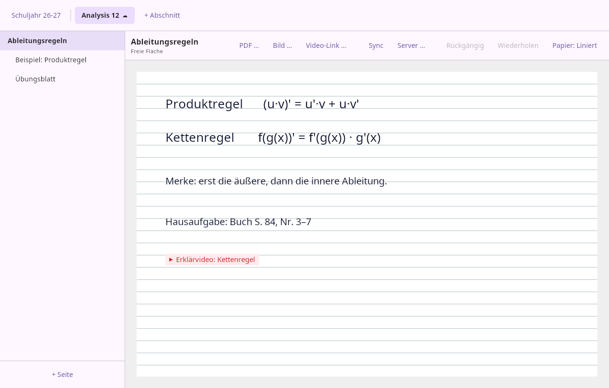
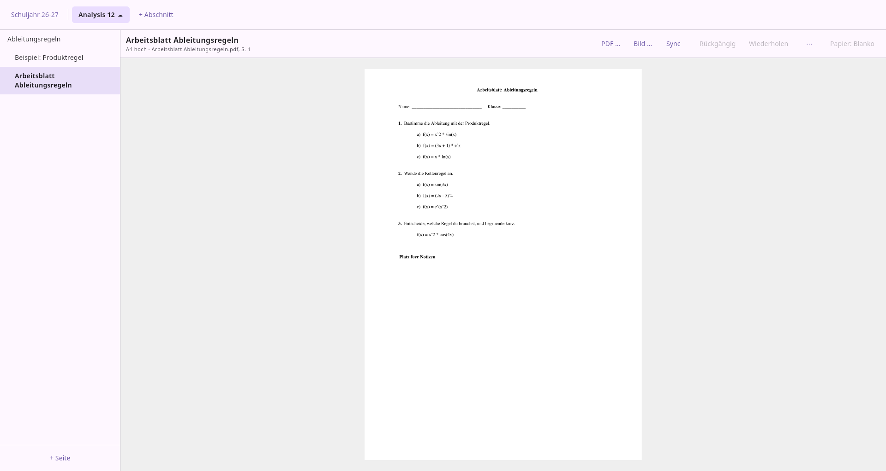

# Skribo

**Unterrichtsplanung am Linux-Desktop, handschriftliches Arbeiten am
CTOUCH-Board — mit einer Vorlage, die man jedes Schuljahr neu beschreiben kann.**



## Warum es das gibt

**OneNote gibt es nicht für Linux.** Der vollwertige Client ist Windows-only, im
Browser bleibt eine abgespeckte Fassung. Wer seinen Unterricht am eigenen
Linux-Rechner vorbereiten will, hat die Wahl zwischen Windows benutzen oder
einem anderen Werkzeug. Skribo ist dieses andere Werkzeug.

Dazu kommt ein Problem, das **OneNote in keiner Fassung löst**: die
Wiederverwendung über Schuljahre. Dort kopiert man Notizbücher oder radiert die
Tinte des Vorjahres weg. Skribo trennt beides sauber:

- die **Basis** einer Seite — Titel, Format, das eingefügte Arbeitsblatt, Texte,
  Bilder, Verweise — bleibt Jahr für Jahr unangetastet;
- die **Handschrift** liegt in einer Ebene *je Schuljahr* darüber.

Ein Jahreswechsel gibt dir also dieselbe Vorlage mit einer sauberen Fläche, und
das Vorjahr bleibt daneben zum Nachschlagen erhalten.

## Für wen

Für Lehrkräfte, die mit einem großen Touchdisplay im Klassenraum arbeiten, ihre
Vorbereitung aber nicht in eine fremde Cloud legen wollen oder können — etwa
weil die Datenschutzaufsicht dem Einsatz von MS 365 an Schulen Grenzen setzt.
Skribo taugt als Rückfallebene, die man aufgebaut hat, *bevor* man sie braucht.

## Was es nicht ist

Damit klar ist, worauf man sich einlässt:

- **Kein Ersatz für die Schülerseite.** Wie Material zu den Schülern kommt,
  bleibt der Schule überlassen (Teams, Moodle, IServ …). Skribos Brücke dorthin
  ist der **PDF-Export** — importierte Arbeitsblätter kommen unverändert wieder
  heraus, zum Verteilen und Ausdrucken.
- **Kein fertiges Produkt.** Es entsteht für den eigenen Bedarf. Vieles fehlt,
  vieles ist rau. Siehe [Stand](#stand).
- **Keine Einsicht der Schüler ins Tafelbild.** Bewusst weggelassen — es hat sich
  im Unterricht als kontraproduktiv erwiesen, weil es aufmerksames Mitschreiben
  untergräbt.

## Aufbau

Skribo besteht aus zwei Programmen und einem gemeinsamen Kern:

| Modul | Verzeichnis | Zweck |
|-------|-------------|-------|
| **Kern** (plattformfrei) | [`shared/`](./shared/) | Datenmodell, On-Disk- und WebDAV-Schema, Strich-Mathematik |
| **Desktop-Client** | [`desktop/`](./desktop/) | Planung am PC (Compose Multiplatform: Linux, Windows, macOS) |
| **Board-Client** | [`android/`](./android/) | Handschrift am CTOUCH-Board oder Android-Tablet |

Beide Clients benutzen denselben Kern — das Schema existiert nur an einer Stelle
und kann zwischen Board und PC nicht auseinanderlaufen. Die Strich-Glättung ist
dieselbe, deshalb sieht ein am Board geschriebener Zug am PC exakt gleich aus.

## Desktop-Client



- **PDF einfügen** — jede Seite wird eine eigene Skribo-Seite mit der gerenderten
  Vorlage im Hintergrund; A4 und Präsentationsfolien werden am Seitenverhältnis
  erkannt. Das **Original wird mitgespeichert** und lässt sich jederzeit wieder
  herausgeben.
- **Auf der Seite schreiben** — Klick ins Leere legt ein Textfeld an, getippt wird
  direkt an Ort und Stelle, mehrzeilig.
- **Anordnen** — auswählen, verschieben, Bilder an der Ecke skalieren;
  Rückgängig/Wiederholen für alles.
- **Bilder und Video-Verweise** — jpg/png werden ins Dokument übernommen,
  YouTube-Links bleiben Verweise (nichts wird heruntergeladen).
- **Struktur** — Abschnitte, Seiten, Unterseiten; Rechtsklick zum Umbenennen,
  Löschen und Anlegen.
- **Ansicht** — scrollen, mit `Strg`+Mausrad zoomen; auch neben dem Blatt ist
  Platz für Notizen am Rand.
- **Schuljahr umschalten** — tauscht nur die Handschrift-Ebene.
- **Abgleichen** — ein Knopf für beide Richtungen; beim Start läuft er von
  selbst. Einstellungen sitzen hinter dem Zahnrad oben rechts.

## Board-Client

- Ink-Engine mit wählbarer Glättung (Bézier, Catmull-Rom, WMA) und
  Motion-Prediction für geringe Latenz
- Werkzeuge: Stift, Textmarker, Linie, Text, Bild, Radierer
- Papierstile: blanko, liniert, kariert, Punkte, gelb liniert
- Zeigt die am PC vorbereiteten Seiten formatgerecht mit ihrer Vorlage
- Gleicht über denselben Server ab — ohne Konto, ohne Anmeldung: WebDAV-Zugang
  einmal eintragen, fertig
- Tuning-/Metrics-Panel zum Vermessen der Zeichenleistung auf dem jeweiligen Board

## Daten und Synchronisierung

Alles liegt als lesbares JSON auf der Platte — kein Datenbankformat, kein
Bindungszwang:

```
document.json                        Abschnitte und Reihenfolge der Seiten
pages/<id>.json                      die stabile Basis einer Seite
annotations/<schuljahr>/<id>.json    die Handschrift dieses Schuljahrs
assets/                              Vorlagen, Bilder, Original-PDFs
```

Auf dem Desktop unter `~/.local/share/skribo` (Linux), `%APPDATA%\skribo`
(Windows) bzw. `~/Library/Application Support/skribo` (macOS). Ein anderer Ort
lässt sich über die Umgebungsvariable `SKRIBO_HOME` wählen.

Die Synchronisierung läuft über einen **selbst betriebenen WebDAV-Server** (etwa
das WebDAV-Paket einer Synology). Adresse, Benutzer und Passwort trägt man unter
dem Zahnrad ein — sie landen in `desktop.properties` neben dem Dokument, **nicht
im Repository**. Ein Abschnitt wird nur synchronisiert, wenn man ihm per
Rechtsklick einen WebDAV-Pfad gibt; ohne Pfad bleibt er lokal.

Es gibt **einen Knopf: „Abgleichen"**. In welche Richtung Daten fließen, ist
Sache des Programms — es sendet und holt in einem Zug. Beim Start gleicht der
Desktop-Client von selbst ab, sofern ein Server eingetragen ist.

> **Der Pfad muss innerhalb einer bestehenden Freigabe liegen.** Auf einer
> Synology listet die WebDAV-Wurzel die Freigaben, und dort lassen sich keine
> neuen Ordner anlegen — `Mathematik/Analysis12` funktioniert, `Analysis12`
> nicht. Skribo erklärt das, wenn es passiert.

**Damit keine Arbeit verlorengeht**, trägt jede Seite einen Änderungszeitpunkt:
Gesendet wird nur, was nicht älter ist als die Fassung auf dem Server, und
übernommen ebenso. Ohne das überschriebe das zuletzt abgleichende Gerät die
Arbeit des anderen — wer am PC nichts geändert hat und danach abgleicht,
löschte sonst die Handschrift, die inzwischen am Board entstanden ist.

Auf dem Server liegt dieselbe Aufteilung wieder:

```
<pfad>/<seite>/skribo/base.json                    die Vorlage
<pfad>/<seite>/skribo/annotations/<schuljahr>.json die Handschrift
<pfad>/<seite>/skribo/assets/                      Vorlagenbilder, Original-PDFs
<pfad>/<seite>/skribo/<unterseite>/…               Unterseiten
```

Weil Vorlage und Handschrift getrennte Dateien sind, können sie beim Abgleich
gar nicht erst kollidieren: Die Vorlage kommt vom Planungsrechner, die
Handschrift vom Board.

## Bauen und starten

Voraussetzung ist ein JDK 17 oder neuer; für den Board-Client zusätzlich das
Android SDK (Pfad in `local.properties`, nicht eingecheckt).

> Entwickelt und benutzt wird unter Linux. Windows und macOS sollten laufen —
> der Code ist plattformneutral und die Paketierung ist eingerichtet —, aber
> **ausprobiert wurde es dort nicht**. Das `.msi` bzw. `.dmg` muss zudem auf dem
> jeweiligen System gebaut werden; `jpackage` kann nicht für andere paketieren.

```bash
./gradlew :desktop:run             # Desktop-Client starten
./gradlew :desktop:packageDeb      # Linux-Paket (analog packageMsi / packageDmg)

./gradlew :android:assembleDebug   # APK bauen
./gradlew :android:installDebug    # auf angeschlossenes Board/Tablet installieren

./gradlew build                    # alles bauen und testen
```

## Stand

In Entwicklung, im täglichen Gebrauch noch nicht erprobt.

**Da:** Planung am Desktop (Struktur, PDF-Import, Text, Bilder, Verweise,
Anordnen, Zoomen), Schuljahr-Ebenen in beiden Clients, Anzeige der Vorlagen am
Board, und die Synchronisierung in beide Richtungen einschließlich der Assets —
**gegen eine echte Synology durchgespielt**: am PC eine Seite anlegen, am Board
darauf schreiben, am PC die Handschrift wiederfinden.

**Fehlt:** Textformatierung; Seiten zwischen Abschnitten verschieben; Suche;
Löschungen werden nicht übertragen (eine lokal gelöschte Seite kommt beim
nächsten Abgleich zurück); und der Abgleich löst Konflikte nach dem Grundsatz
„die neuere Fassung gewinnt" — wer dieselbe Seite an beiden Geräten ändert,
ohne zwischendurch abzugleichen, verliert die ältere Fassung.

> ⚠️ **Geprüft ist bisher nur gegen eine Synology (DSM).** Nextcloud, Apache
> oder ownCloud verhalten sich in Details anders — bei den PROPFIND-Antworten,
> den Statuscodes und den erlaubten Zeichen in Ordnernamen. Und genau dort
> steckten die Fehler: Ein Seitentitel mit Punkt am Ende („Stundenentwurf
> 20.08.") ließ DSM den Ordner eigenmächtig umbenennen; zwei Seiten gleichen
> Titels landeten im selben Ordner. Beides ist behoben, aber es zeigt, wo man
> hinsehen muss.
>
> **Wer es ausprobiert, sollte mit einem eigenen Testordner anfangen** — einem
> Abschnitt mit einem Pfad wie `home/skribo-test`, nicht mit dem Ordner, in dem
> echtes Material liegt.

Nützlich für eine Fehlermeldung: welcher Server (Produkt und Version), was
passieren sollte, was stattdessen passierte, und die Meldung, die Skribo
angezeigt hat.

Vollständiger Projektkontext, Entscheidungen und Milestones stehen in
[`PROJECT.md`](./PROJECT.md) — inklusive der Begründungen, die sich unterwegs als
falsch herausgestellt haben.

## Mitmachen

Wenn du in derselben Lage bist: Fehlerberichte und Verbesserungen sind
willkommen. Das Projekt entsteht neben dem Schulalltag, Antworten können dauern.

## Lizenz

[GNU General Public License v3.0](./LICENSE)
